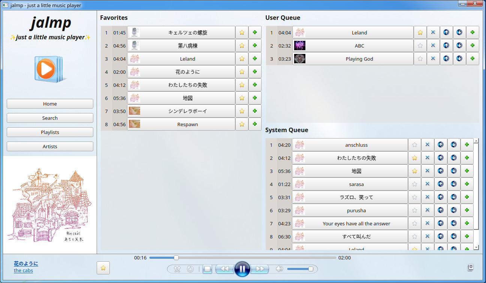

# CS202 Project: jalmp - just a little music player

Author: 22125113 - Nguyen Quang Truong

This project is a music player that can stream music from a server. It is inspired by Windows Media Player version 11/12. The project is written in C++, uses Qt framework for GUI and [jalsock](https://github.com/jaltext/jalsock/tree/devel-jalmp) (my C++ wrapper for the C POSIX socket API) for networking.

## Features

It currently supports the following features:
- Playing music from a server;
- Basic audio control;
- Displaying music information (title, artist, album, album cover, etc.);
- Displaying lyrics;
- Adjust track positions in the queue;
- ... and more!

## Compatibility

As jalsock is built on top of the C POSIX socket API, it is not cross-platform. Therefore, the project is only available on Unix-compliant systems.

However, such compatibility can be achieved by replacing jalsock with Winsock (for Windows) or a cross-platform networking library.

## Demonstration

[Here is the demonstration on YouTube.](https://youtu.be/W366DG6BUpc)

## Repository
[Here is the repository of the project on GitHub.](https://github.com/jalsol/jalmp)

## Dependencies

- C++20 (GNU GCC 11.3.0)
- CMake 3.5 or above
- Qt 6 (with `Multimedia` and `Sql` components)
- An SQL database (tested with MariaDB 10.6.12)

## Building & Running

- Clone the repository along with its submodules;
- Open the project in Qt Creator and build `jalmp`;
- Build `jalmp_server` with CMake in the submodules directory;
- Run `jalmp_server`;
- Run `jalmp`.

## Modeling structures overview

Please refer to the [`docs/diagrams/`](docs/diagrams) directory for more details.